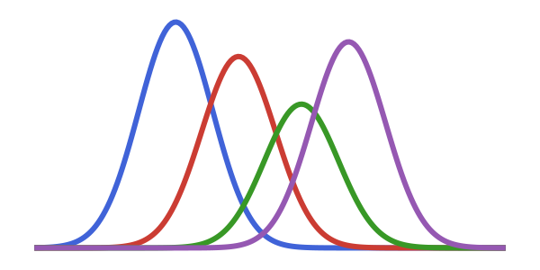

<table align="center">
  <tr>
    <td></td>
    <td>
      <h1>RadialBasisFunctions.jl</h1>
      <p>High-performance radial basis function interpolation<br>and differential operators for Julia.</p>
    </td>
  </tr>
</table>

<p align="center">
  <a href="https://JuliaMeshless.github.io/RadialBasisFunctions.jl/stable"></a>
  <a href="https://JuliaMeshless.github.io/RadialBasisFunctions.jl/dev"></a>
  <a href="https://github.com/JuliaMeshless/RadialBasisFunctions.jl/actions/workflows/CI.yml?query=branch%3Amain"></a>
  <a href="https://codecov.io/gh/JuliaMeshless/RadialBasisFunctions.jl"></a>
  <a href="https://github.com/JuliaMeshless/RadialBasisFunctions.jl/blob/master/LICENSE"></a>
  <a href="https://zenodo.org/badge/latestdoi/634682663"></a>
</p>

---

*Also known as: meshfree methods, meshless methods, RBF-FD (Radial Basis Function Finite Differences), scattered data interpolation, kernel methods, polyharmonic splines, collocation methods*

---

## Why RadialBasisFunctions.jl?

- **Truly Meshless** - Work directly with scattered points, no mesh generation required
- **GPU Ready** - Seamless CPU/GPU execution via [KernelAbstractions.jl](https://github.com/JuliaGPU/KernelAbstractions.jl)
- **Flexible Operators** - Built-in Laplacian, gradient, partial derivatives, or define your own custom operators
- **Boundary Conditions** - Hermite interpolation for Dirichlet, Neumann, and Robin BCs in PDE applications
- **Local Collocation** - k-nearest neighbor stencils for scalable large-domain problems
- **Differentiable** - AD-compatible via Enzyme and Mooncake extensions

<p align="center">
  
</p>

<p align="center"><em>Scattered data points (left) reconstructed as a smooth surface using RBF interpolation (right)</em></p>

## Quick Start

```julia
using RadialBasisFunctions, StaticArrays

# Create scattered 2D points
points = [SVector{2}(rand(2)) for _ in 1:500]
f(x) = sin(4x[1]) * cos(3x[2])
values = f.(points)

# Interpolation - evaluate anywhere in the domain
interp = Interpolator(points, values)
interp(SVector(0.5, 0.5))

# Differential operators - apply to scattered data
lap = laplacian(points)       # Laplacian operator
grad = gradient(points)       # Gradient operator
∂x = partial(points, 1, 1)    # ∂/∂x₁

lap_values = lap(values)      # Apply Laplacian to data
grad_values = grad(values)    # Returns Nx2 matrix of gradients
```

## Supported Radial Basis Functions

| Type | Formula | Best For |
|------|---------|----------|
| Polyharmonic Spline (PHS) | $r^n$ where $n = 1, 3, 5, 7$ | General purpose, no shape parameter tuning needed |
| Inverse Multiquadric (IMQ) | $1 / \sqrt{(\varepsilon r)^2 + 1}$ | Smooth interpolation with tunable accuracy |
| Gaussian | $e^{-(\varepsilon r)^2}$ | Infinitely smooth functions |

All basis functions support polynomial augmentation (enabled by default) for enhanced accuracy.

```julia
# Basis function examples
basis = PHS(3)                  # Cubic PHS (default: quadratic polynomial augmentation)
basis = PHS(5; poly_deg=3)      # Quintic PHS with cubic polynomials
basis = IMQ(1.0)                # IMQ with shape parameter ε=1.0
basis = Gaussian(0.5)           # Gaussian with shape parameter ε=0.5
```

## Installation

```julia
using Pkg
Pkg.add("RadialBasisFunctions")
```

Requires Julia 1.10 or later.

## Advanced Features

### Hermite Interpolation for PDEs

Handle boundary conditions properly with Hermite interpolation:

```julia
# Build operator with boundary awareness
lap = laplacian(points, eval_points, PHS(3), k,
                boundary_nodes, boundary_conditions, normals)
```

### GPU Acceleration

Operators automatically leverage GPU when data is on device:

```julia
using CUDA
points_gpu = cu(points)
lap_gpu = laplacian(points_gpu)  # Weights computed on GPU
```

### Custom Operators

Define any differential operator using automatic differentiation:

```julia
# Example: custom operator
my_op = custom(points, basis -> (x, xc) -> your_derivative_function(basis, x, xc))
```

## Documentation

- **[Getting Started](https://JuliaMeshless.github.io/RadialBasisFunctions.jl/stable/getting_started)** - Tutorials and examples
- **[Theory](https://JuliaMeshless.github.io/RadialBasisFunctions.jl/stable/theory)** - Mathematical background on RBF methods
- **[API Reference](https://JuliaMeshless.github.io/RadialBasisFunctions.jl/stable/api)** - Full function documentation

## Citation

If you use RadialBasisFunctions.jl in your research, please cite:

```bibtex
@software{RadialBasisFunctions_jl,
  author = {Beggs, Kyle},
  title = {RadialBasisFunctions.jl: Meshless RBF interpolation and differential operators for Julia},
  url = {https://github.com/JuliaMeshless/RadialBasisFunctions.jl},
  doi = {10.5281/zenodo.7941390}
}
```

## Contributing

Contributions are welcome! Please feel free to:

- Report bugs or request features on [GitHub Issues](https://github.com/JuliaMeshless/RadialBasisFunctions.jl/issues)
- Start a discussion on [GitHub Discussions](https://github.com/JuliaMeshless/RadialBasisFunctions.jl/discussions)
- Submit pull requests

Part of the [JuliaMeshless](https://github.com/JuliaMeshless) organization.
