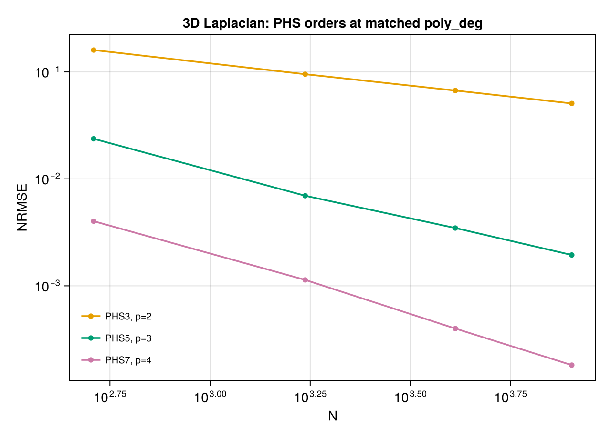
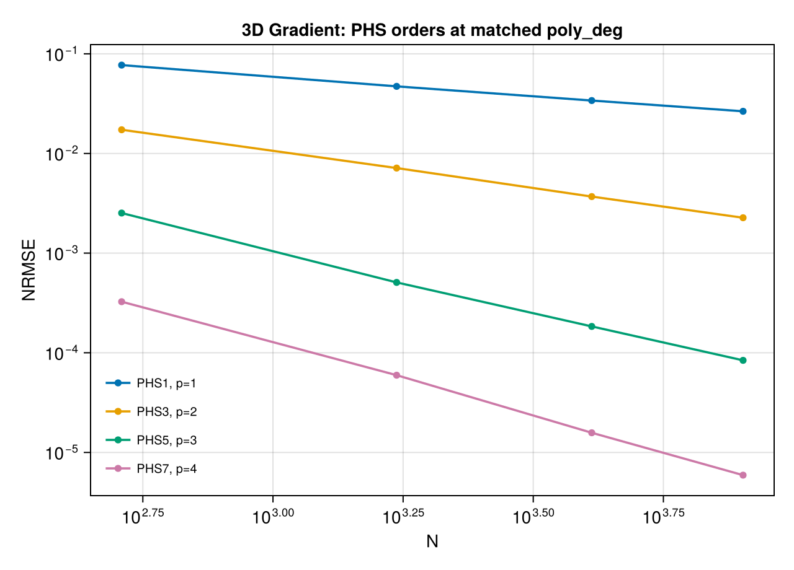
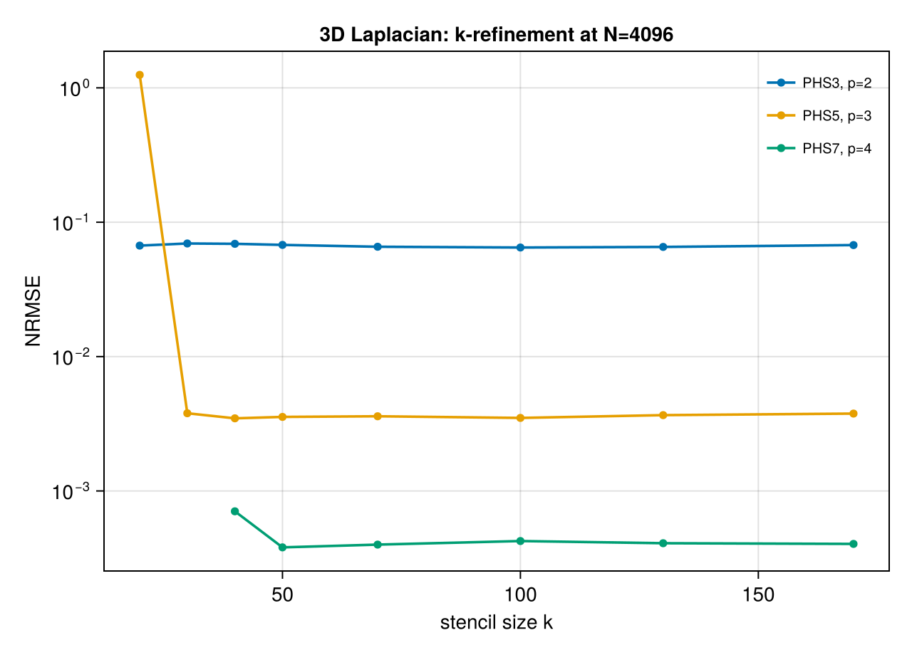

# 3D Extensions

RBF-FD generalizes directly to 3D: stencil neighborhoods become spheres instead of disks,
and `poly_deg` is interpreted in 3D polynomial space. This page verifies that the 2D
convergence story carries over and flags the main practical difference: stencil sizes
must grow to accommodate the larger 3D polynomial basis.

Test function: `g(x) = 1 + sin(3x₁) + cos(2x₂) + sin(x₃)` (separable trig, known
Laplacian and gradient). Point sweep: `n_side ∈ {8, 12, 16, 20}` → `N ∈ {512, 1728, 4096, 8000}`.

## Laplacian (3D)

!!! warning "Excluded: PHS1/p=1"
    Omitted from the plot — same pathology as in 2D. Never use PHS1 for second-derivative
    operators.

Same convergence-order story as 2D: PHS3/p=2 gives approximately `O(h²)`, PHS5/p=3 gives
`O(h⁴)`, PHS7/p=4 gives `O(h⁶)`. The slopes look shallower in this plot than in 2D
because the x-axis range is only ~1.2 decades (vs ~1.7 in 2D) — a consequence of
`N = n_side³` making 3D sweeps expensive.

## Gradient (3D)

First-derivative convergence also carries over cleanly to 3D.

## Stencil size (3D Laplacian)

The key practical difference from 2D: **3D stencils need to be larger** because the
3D polynomial basis has more monomials at each degree (`binomial(3+p, p)` vs
`binomial(2+p, p)` in 2D). For example, `poly_deg=3` in 3D has 20 monomials vs 10 in 2D,
so a 3D stencil with `k ≈ 35–50` plays the same role as a 2D stencil with `k ≈ 15–20`.
`autoselect_k(data, basis)` accounts for this automatically.
