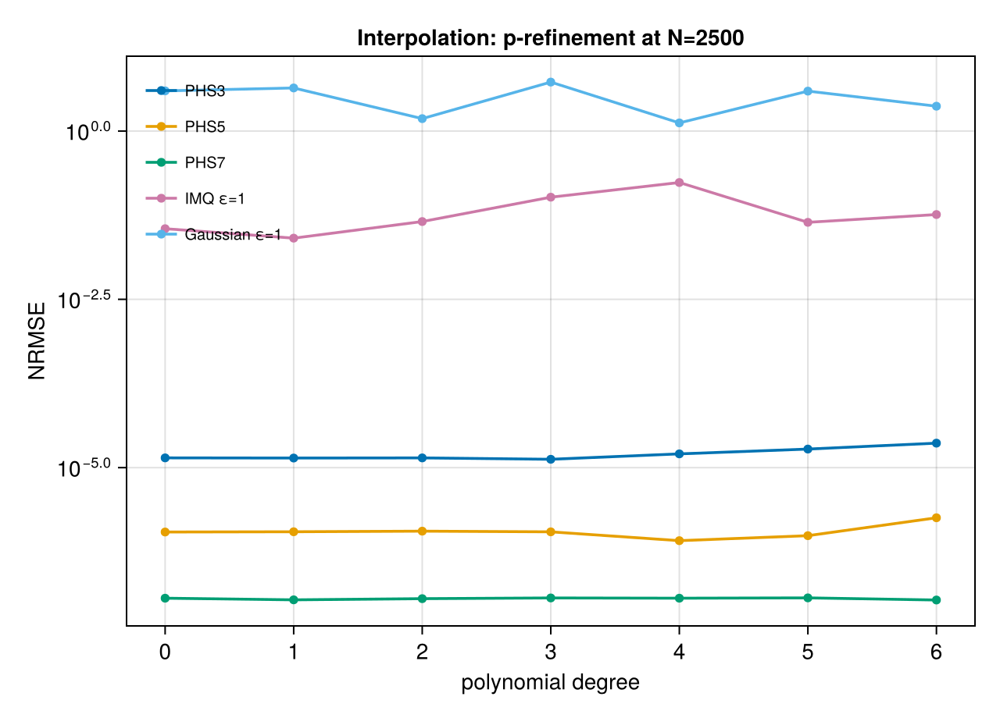
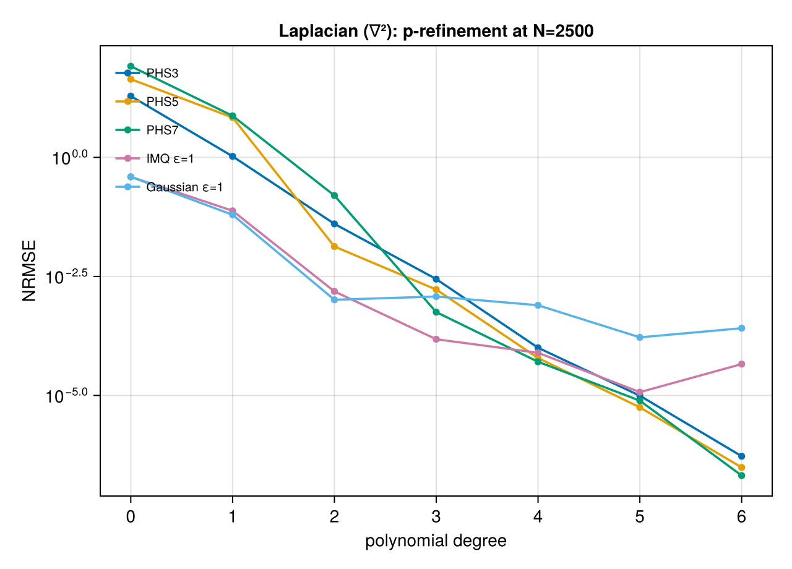
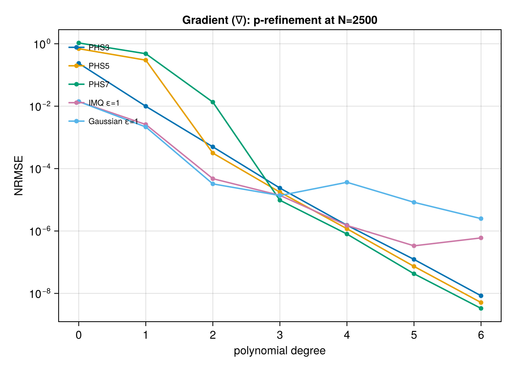
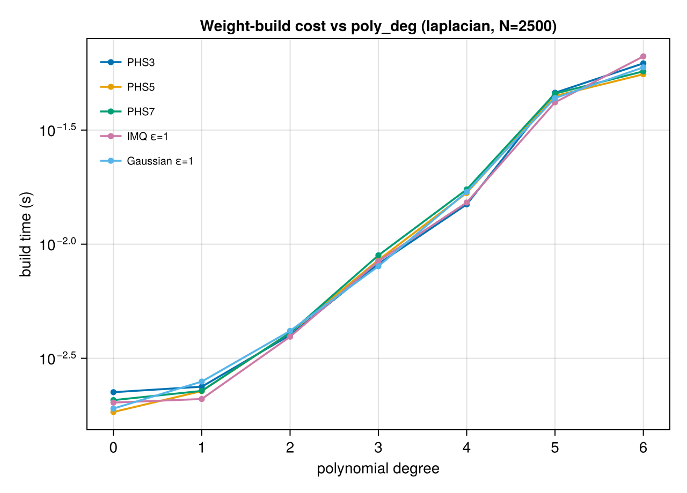
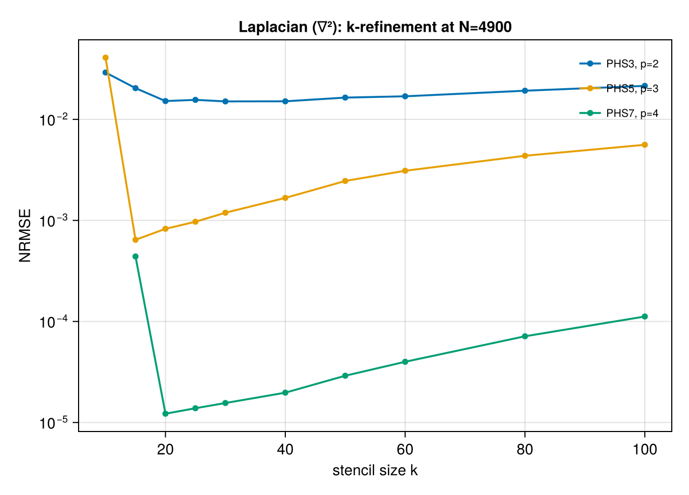
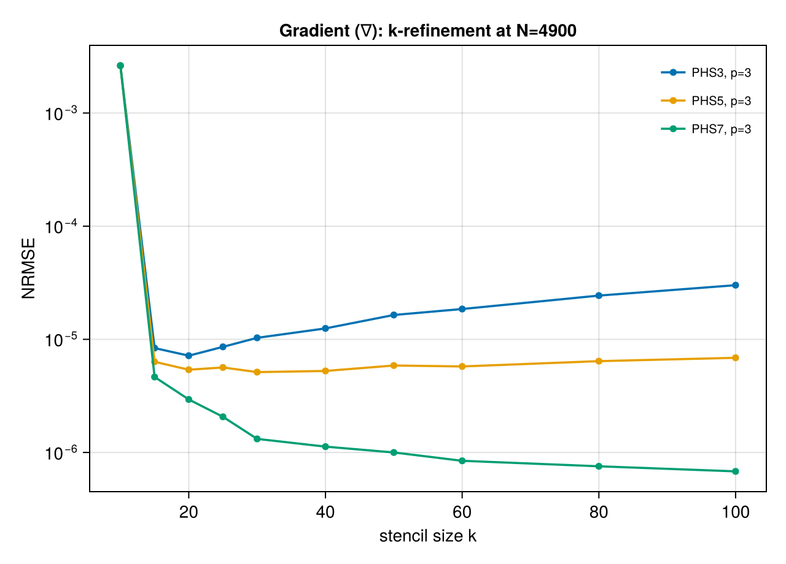
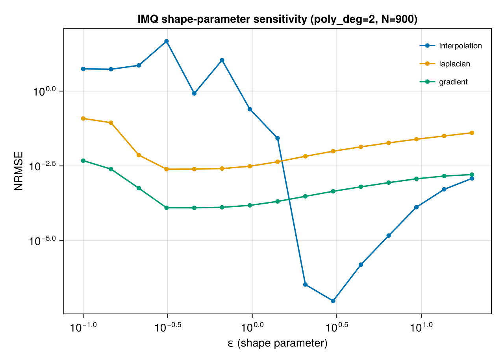
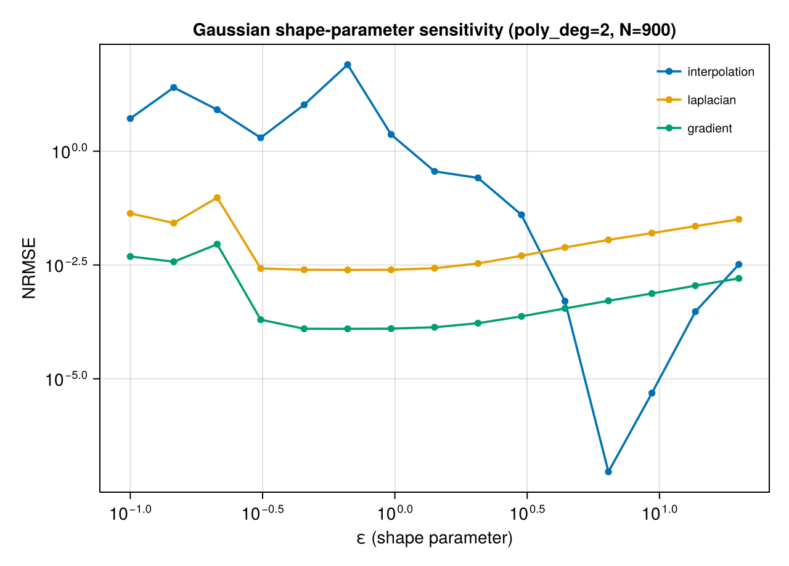
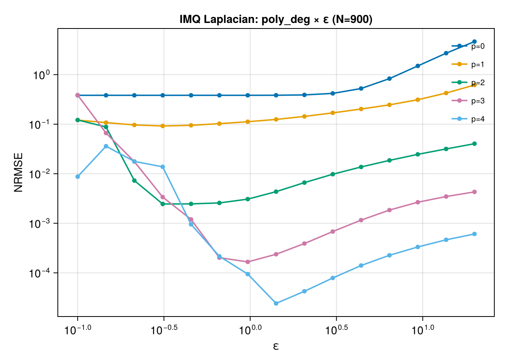
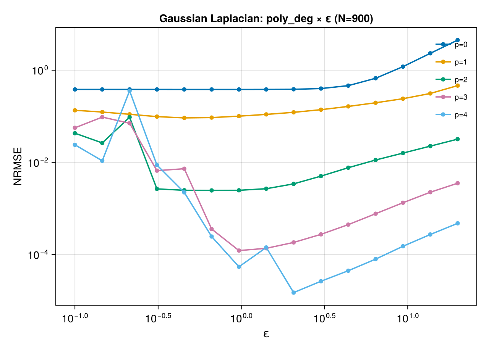

# Refinement Sweeps

Three refinement knobs act orthogonally to the point count `N`:

- **p-refinement**: polynomial augmentation degree at fixed `N`
- **k-refinement**: stencil size (nearest neighbors per point) at fixed `N`, `poly_deg`
- **ε-refinement**: shape parameter for `IMQ` / `Gaussian`

## Polynomial degree (p-refinement)

With all other parameters fixed, error typically decreases with each increment of
`poly_deg` until the basis smoothness caps the achievable rate. Beyond that point,
additional polynomial degree adds cost (more monomials, larger local systems) with no
accuracy benefit.

### Interpolation

Each curve is flat — polynomial degree has essentially no effect on `Interpolator`
accuracy at fixed `N`. This is not a bug. `Interpolator` is a **global** method: it uses
all `N` points in one collocation system, so the RBF's native smoothness already
reproduces the target to whatever accuracy that kernel can achieve, and the polynomial
augmentation contributes only a low-order reproducing property that doesn't change the
answer on a smooth non-polynomial target like Franke. Contrast with the local-stencil
differential operators below, where `poly_deg` controls local approximation and matters
a great deal.

**Practical implication:** for `Interpolator`, pick the smallest `poly_deg` that meets
your reproducing-polynomial needs (usually `poly_deg = 2`) — going higher adds cost
without accuracy.

### Laplacian

IMQ and Gaussian hit a stagnation floor around `poly_deg=3–4` for this problem size —
the shape parameter becomes the bottleneck. PHS curves keep dropping.

### Gradient

### Cost side

Higher `poly_deg` grows the local system size as `binomial(d+p, p)` in `d` dimensions —
in 2D that's 1, 3, 6, 10, 15, 21 monomials for `p = 0..5`. Build time grows
super-linearly.

## Stencil size (k-refinement)

The number of nearest neighbors per stencil. `autoselect_k(data, basis)` picks a
reasonable default based on the basis order.

### Interpolation

`Interpolator` uses a *global* stencil (all points), so k-refinement does not apply.

### Laplacian

A clear U-shape: too few neighbors under-resolves the local polynomial; too many
introduces extraneous points that hurt local fit quality. For PHS5/p=3 the sweet spot is
around k=15–20; PHS7/p=4 minimizes around k=20–25. The exact optimum depends on point
distribution, so the autoselect defaults give a safe starting point rather than a tuned
one.

### Gradient

Same U-shape with minima at similar k. First-derivative operators are less sensitive to
stencil size than second-derivative ones.

## Shape parameter (ε-refinement)

IMQ and Gaussian use a shape parameter `ε` that controls basis width. Smaller `ε` yields
flatter (wider-support) basis functions — in principle more accurate, but the
corresponding linear systems become severely ill-conditioned, so numerical error
dominates below a threshold.

### IMQ shape-parameter sensitivity

Interpolation has a sharp minimum around `ε ≈ 3`, with error 100× worse at ε=0.1 or
ε=10. Differential operators have gentler U-curves with optima around `ε ≈ 0.3–0.5`.

### Gaussian shape-parameter sensitivity

### Effect of poly_deg on ε sensitivity (IMQ Laplacian)

Higher polynomial augmentation flattens the ε dependence — the polynomial basis absorbs
the responsibility for low-frequency modes, making the system less reliant on tuning `ε`
precisely.

### Effect of poly_deg on ε sensitivity (Gaussian Laplacian)

### Practical guidance

- For routine use, start at `ε = 1.0` with `poly_deg = 2` — it's within a factor of 10
  of optimal for every operator in the sweeps above.
- Only tune `ε` if you're chasing the last order of magnitude and have benchmark data
  from your specific problem geometry.
- For ill-conditioning concerns, use PHS — it has no shape parameter and doesn't exhibit
  the "flatter is better until it isn't" tradeoff.
