# Scalar Operators

Convergence behavior for `Interpolator`, `laplacian`, `gradient`, `partial`, and mixed
partials. Each operator section shows two h-refinement plots that together answer:

1. **Which PHS order?** — PHS3/5/7 all at `poly_deg = 3`. Holding the polynomial
   augmentation fixed isolates the effect of RBF smoothness alone; curves should be
   parallel on log-log (same asymptotic slope, different offsets).
2. **How much poly_deg?** — polynomial degree sweep for each PHS order.

PHS1 is omitted from these plots: at `poly_deg = 3` it would need data at a degree
above its matched minimum, and its low kernel smoothness makes it uninteresting as a
comparison point. See the [matched-degree rule](index.md#matched-polynomial-degree-for-phs)
in the overview if you need guidance on the minimum `poly_deg` per PHS order.

IMQ and Gaussian h-refinement is covered on its own page
([Shape-Parameter Bases](shape-parameter-bases.md)) — their behavior is dominated
by the interaction between `ε` and the stencil spacing, which deserves a single
focused discussion rather than a repeated subsection per operator.

See the [index](index.md) for notation and methodology.

## Interpolation

`Interpolator` performs global RBF interpolation (all points enter every weight).
Expected convergence for polynomial augmentation degree `m` is `O(h^{m+1})`.

### Which PHS order?

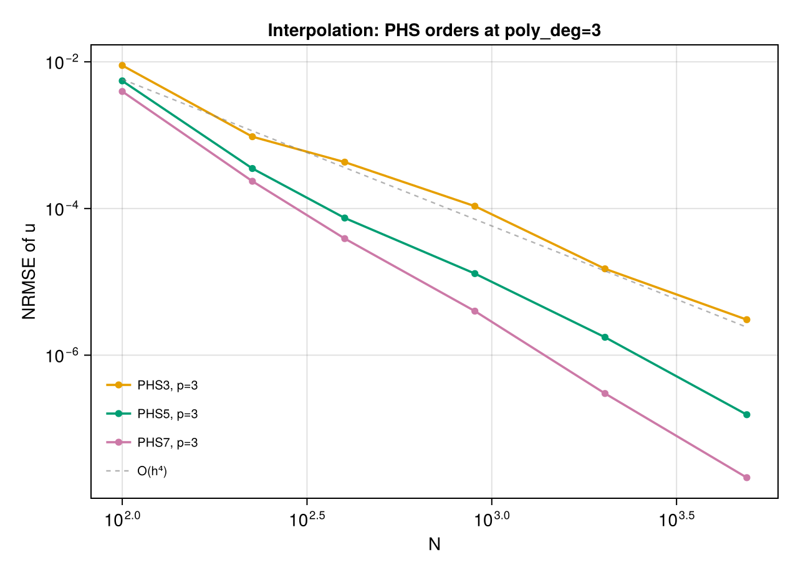

All three curves run parallel at the expected `O(h⁴)` slope. The only difference is the
constant (vertical offset): PHS7 sits lowest, PHS5 in the middle, PHS3 on top. This is
the clean signature — higher kernel smoothness does not change the rate but pays a
smaller constant.

### How much polynomial degree?

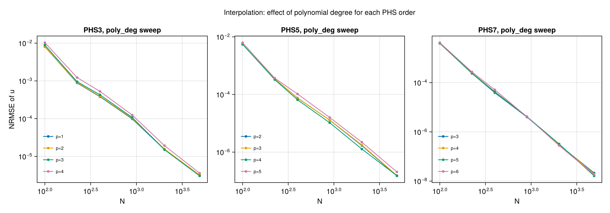

For each PHS order, adding more polynomial degree beyond the matched minimum generally
helps — but with diminishing returns. PHS3 benefits from going up to p=4; PHS5 and PHS7
saturate around p=4–5 for this problem size.

## Laplacian (∇²)

Expected rate for polynomial degree `m`: `O(h^{m-1})` in 2D.

!!! warning "Excluded combinations"
    `PHS1/p=1` and `PHS3/p=1` are **not plotted** below because they do not converge
    for second derivatives. PHS1/p=1 is numerically pathological (errors near `10¹⁴`);
    PHS3/p=1 plateaus near `O(1)` error regardless of `N`. Use `poly_deg ≥ 2` and
    avoid PHS1 entirely for second derivatives. Shape-parameter bases have their own
    conditioning story — see [Shape-Parameter Bases](shape-parameter-bases.md).

### Which PHS order?

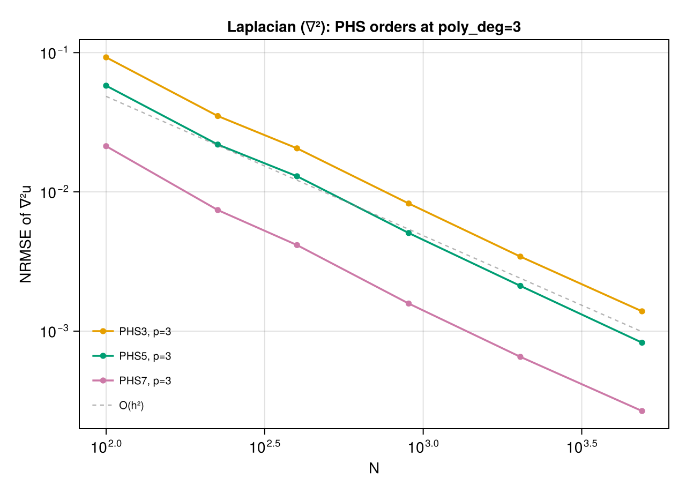

All three PHS orders converge at `O(h²)` — the `poly_deg - 1 = 2` rate expected for a
second derivative at poly_deg=3. Lines are approximately parallel; PHS7 has the smallest
error constant, PHS3 the largest. The takeaway: once polynomial augmentation is held
fixed, PHS order trades cost for a constant-factor reduction in error, not a better
asymptotic rate.

### How much polynomial degree?

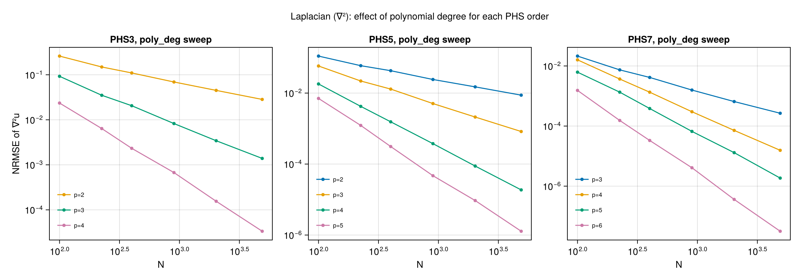

Increasing poly_deg by one typically adds two orders of convergence until the RBF
smoothness caps the rate.

## Gradient (∇)

Expected rate for polynomial degree `m`: `O(h^m)` in 2D for each component.

### Which PHS order?

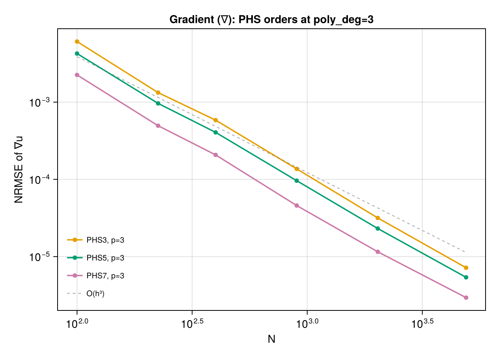

All three PHS orders follow the expected first-derivative rate `O(h³)` at poly_deg=3.
Parallel lines; PHS7 has the smallest constant.

### How much polynomial degree?

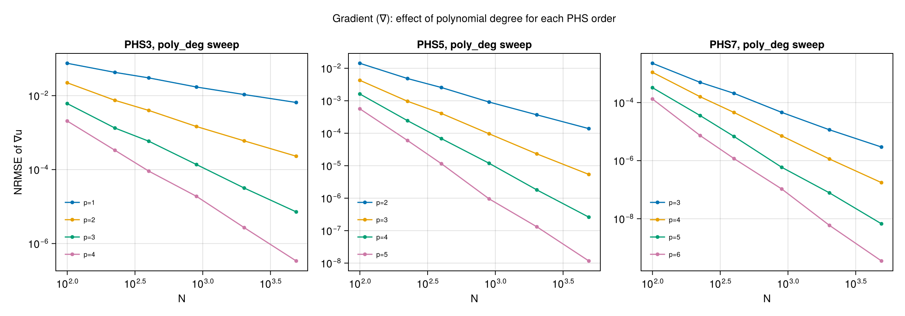

## First partial (∂/∂xᵢ)

`partial(pts, 1, 1)` extracts a single gradient component. The convergence story matches
the gradient exactly — which is reassuring, since internally it is a subset of the same
stencil computation.

### Which PHS order?

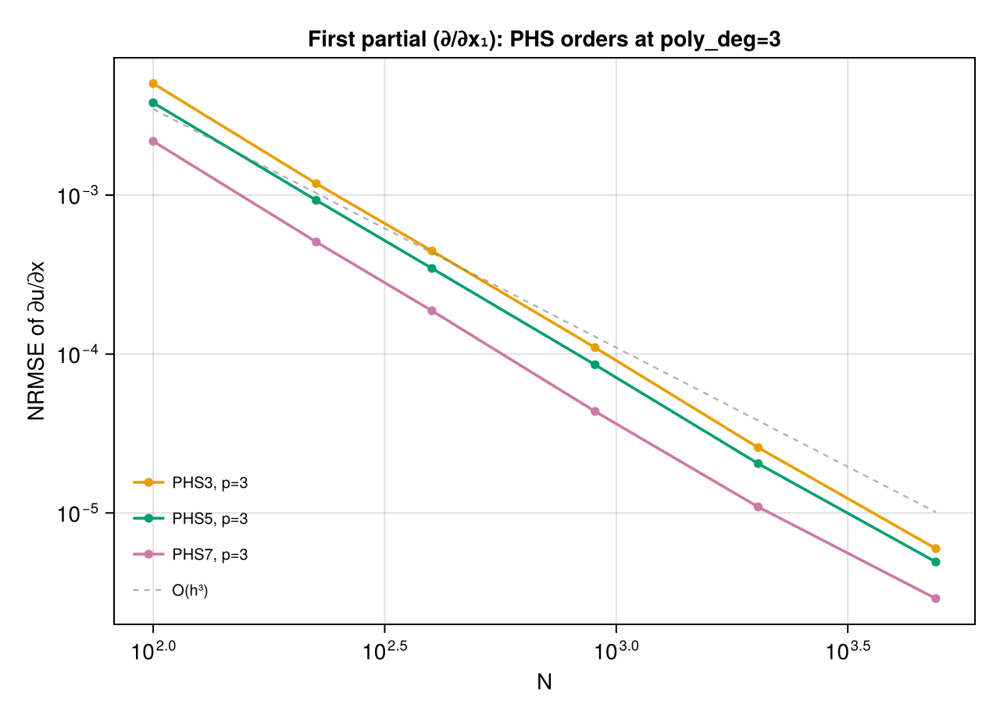

Parallel `O(h³)` convergence across PHS3/5/7, matching the gradient story.

### How much polynomial degree?

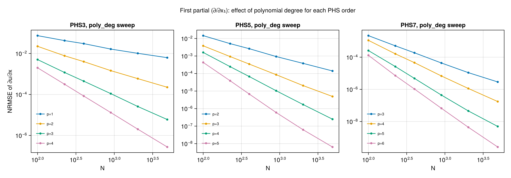

## Second partial (∂²/∂xᵢ²)

`partial(pts, 2, 1)` — a single second derivative. Same caveats as the Laplacian:
PHS1/p=1 is unusable; PHS3/p=2 gives canonical `O(h²)`.

!!! warning "Excluded combinations"
    Same set as [Laplacian](#laplacian-) above: `PHS1/p=1` and `PHS3/p=1` are omitted
    for non-convergence.

### Which PHS order?

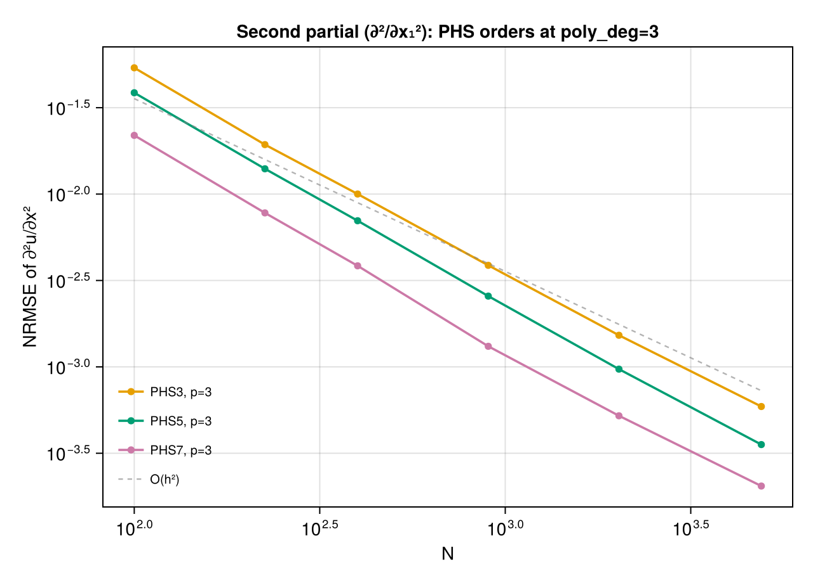

Parallel `O(h²)` convergence across PHS3/5/7 — same rate as the Laplacian.

### How much polynomial degree?

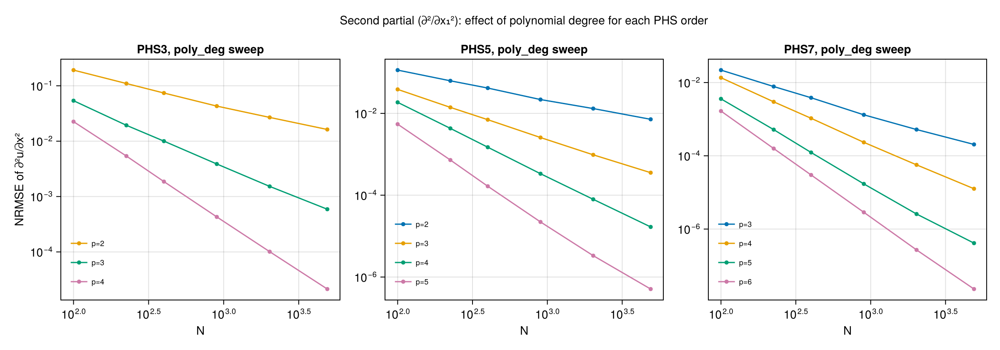

## Mixed partial (∂²/∂xᵢ∂xⱼ)

`mixed_partial(pts, 1, 2)` — a cross derivative. This operator is **more demanding** than
the Laplacian: the Laplacian averages diagonal entries of the Hessian (which have radial
symmetry under PHS), while mixed partials don't benefit from that symmetry.

!!! warning "Excluded combinations"
    A surprisingly long list of PHS combinations do not converge for mixed partials
    and are omitted from the plots below:

    - `PHS1/p=1` (error `~3`, no convergence)
    - `PHS3/p=1` and `PHS3/p=2` (error `~2` and `~10` respectively, no convergence)
    - `PHS5/p=2` (error `~10`, no convergence)

    **Minimum viable PHS configurations:** `PHS3/p=3` or `PHS5/p=3`. For IMQ and
    Gaussian, `poly_deg ≥ 3` is required regardless of ε — see
    [Shape-Parameter Bases](shape-parameter-bases.md).

### Which PHS order?

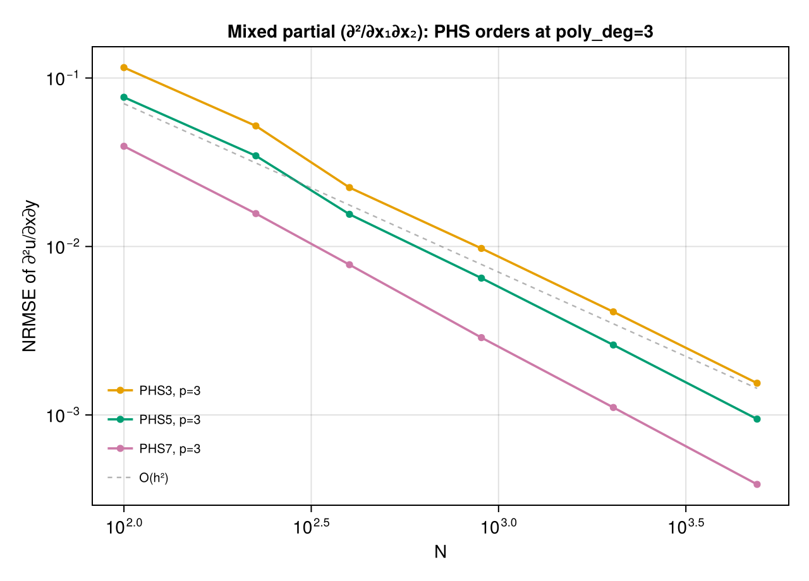

All three PHS orders at `poly_deg = 3` converge cleanly at `O(h²)` — the mixed-partial
non-convergence seen at lower polynomial degrees (see the warning above) is resolved
here. PHS7 has the smallest error constant, as usual.

### How much polynomial degree?

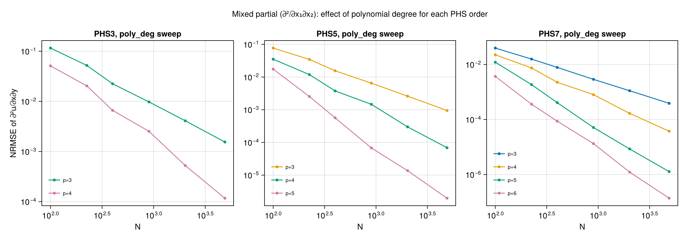

Raising PHS3 to `p=3` is one path; PHS5/p=3 is the cleaner one.
