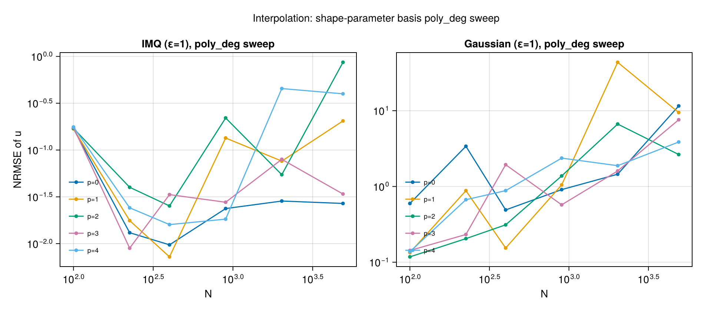
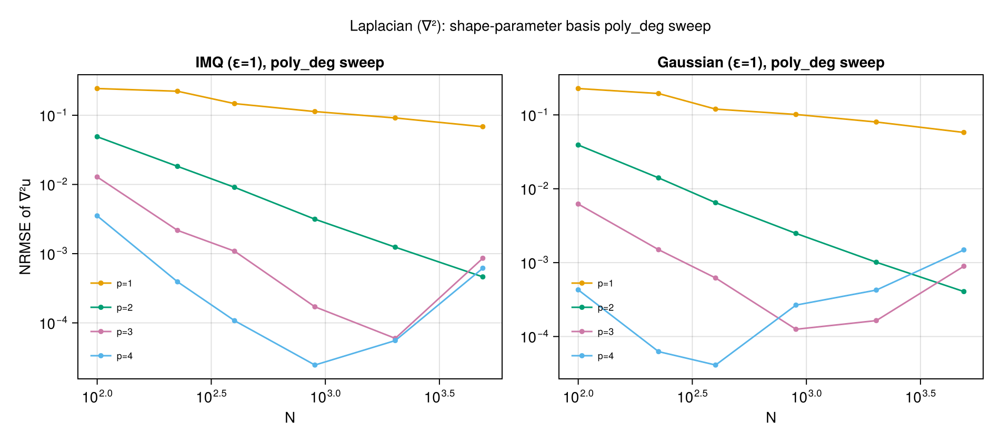
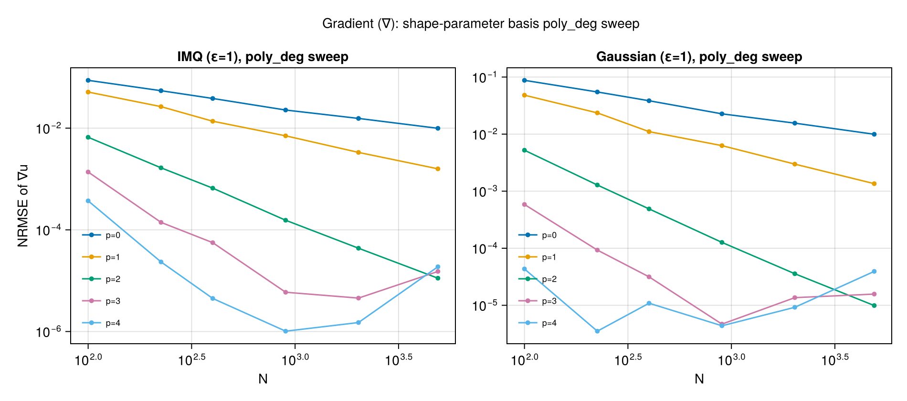
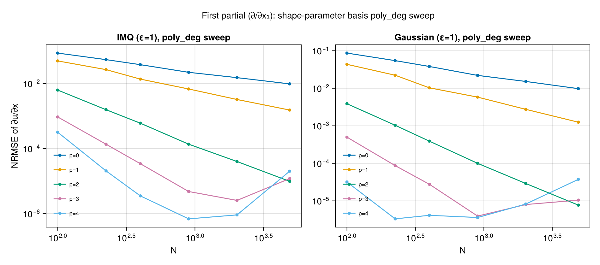
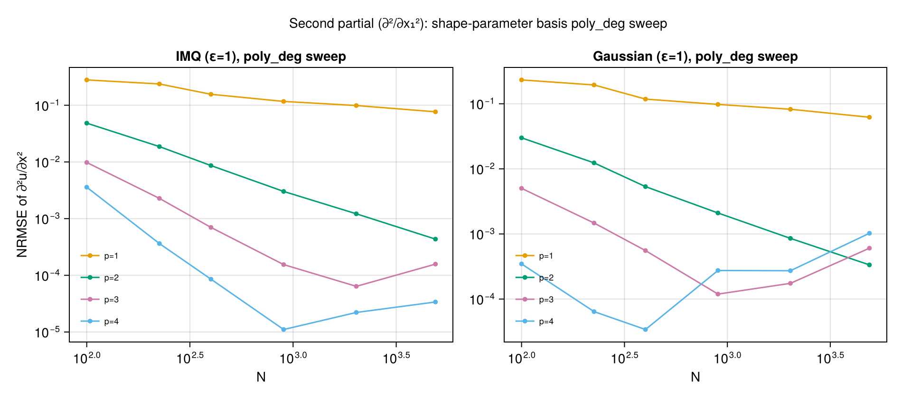
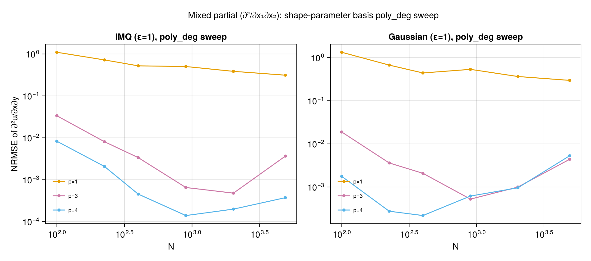

# Scalar Operators

Convergence behavior for `Interpolator`, `laplacian`, `gradient`, `partial`, and mixed
partials. Each operator section shows three h-refinement plots that together answer:

1. **Which PHS order?** — `O(h^p)` slopes with all four orders at matched polynomial degree.
2. **How much poly_deg?** — polynomial degree sweep for each PHS order.
3. **Do IMQ / Gaussian help?** — the same sweep for shape-parameter bases.

See the [index](index.md) for notation and methodology.

## Interpolation

`Interpolator` performs global RBF interpolation (all points enter every weight).
Expected convergence for polynomial augmentation degree `m` is `O(h^{m+1})`.

### Which PHS order?

PHS1/p=1 converges slowly at `O(h²)`; PHS3/p=2 at `O(h³)`; PHS5/p=3 and PHS7/p=4 converge
fastest and sit on the same curve (both exceed the native basis smoothness on the chosen
test function). For smooth targets like Franke, PHS5/p=3 is the sweet spot — PHS7/p=4 adds
cost without additional accuracy.

### How much polynomial degree?

For each PHS order, adding more polynomial degree beyond the matched minimum generally
helps — but with diminishing returns. PHS3 benefits from going up to p=4; PHS5 and PHS7
saturate around p=4–5 for this problem size.

### Do IMQ / Gaussian help?

At `ε=1` both shape-parameter bases converge, with higher poly_deg shifting the error
floor down. Their convergence is not faster than PHS and they require tuning `ε` —
PHS remains the no-tuning default.

## Laplacian (∇²)

Expected rate for polynomial degree `m`: `O(h^{m-1})` in 2D.

!!! warning "Excluded combinations"
    `PHS1/p=1`, `PHS3/p=1`, `IMQ(ε=1)/p=0`, and `Gaussian(ε=1)/p=0` are **not plotted**
    because they do not converge for second derivatives. PHS1/p=1 is numerically
    pathological (errors near `10¹⁴`); the others plateau near `O(1)` error regardless
    of `N`. Use `poly_deg ≥ 2` with any basis, and avoid PHS1 entirely for second
    derivatives.

### Which PHS order?

PHS3/p=2 gives the canonical `O(h²)` convergence and is usually sufficient. PHS5/p=3
reaches `O(h⁴)`, PHS7/p=4 reaches `O(h⁶)`.

### How much polynomial degree?

Increasing poly_deg by one typically adds two orders of convergence until the RBF
smoothness caps the rate.

### Do IMQ / Gaussian help?

IMQ and Gaussian at `ε=1` match PHS convergence rates when paired with adequate poly_deg.
For production use PHS3/p=2 is the simplest choice; reach for IMQ/Gaussian only if your
problem motivates a specific shape parameter.

## Gradient (∇)

Expected rate for polynomial degree `m`: `O(h^m)` in 2D for each component.

### Which PHS order?

PHS orders follow their expected rates `O(h)`, `O(h³)`, `O(h⁵)`, `O(h⁷)` for PHS1/3/5/7
at matched poly_deg. Unlike second-derivative operators, PHS1 is well-behaved for the
gradient.

### How much polynomial degree?

### Do IMQ / Gaussian help?

## First partial (∂/∂xᵢ)

`partial(pts, 1, 1)` extracts a single gradient component. The convergence story matches
the gradient exactly — which is reassuring, since internally it is a subset of the same
stencil computation.

### Which PHS order?

### How much polynomial degree?

### Do IMQ / Gaussian help?

## Second partial (∂²/∂xᵢ²)

`partial(pts, 2, 1)` — a single second derivative. Same caveats as the Laplacian:
PHS1/p=1 is unusable; PHS3/p=2 gives canonical `O(h²)`.

!!! warning "Excluded combinations"
    Same set as [Laplacian](#laplacian-) above: `PHS1/p=1`, `PHS3/p=1`, `IMQ/p=0`,
    `Gaussian/p=0` are omitted for non-convergence.

### Which PHS order?

### How much polynomial degree?

### Do IMQ / Gaussian help?

## Mixed partial (∂²/∂xᵢ∂xⱼ)

`mixed_partial(pts, 1, 2)` — a cross derivative. This operator is **more demanding** than
the Laplacian: the Laplacian averages diagonal entries of the Hessian (which have radial
symmetry under PHS), while mixed partials don't benefit from that symmetry.

!!! warning "Excluded combinations"
    A surprisingly long list of combinations do not converge for mixed partials and are
    omitted from all three plots below:

    - `PHS1/p=1` (error `~3`, no convergence)
    - `PHS3/p=1` and `PHS3/p=2` (error `~2` and `~10` respectively, no convergence)
    - `PHS5/p=2` (error `~10`, no convergence)
    - `IMQ(ε=1)/p=0` and `IMQ(ε=1)/p=2` (plateau; p=2 actually diverges slightly)
    - `Gaussian(ε=1)/p=0` and `Gaussian(ε=1)/p=2` (same behavior)

    **Minimum viable configurations:** `PHS3/p=3` or `PHS5/p=3` on the PHS side;
    `IMQ/p=3` or `Gaussian/p=3` on the shape-parameter side.

### Which PHS order?

Only PHS5/p=3 and PHS7/p=4 remain — the matched polynomial degrees for PHS1 and PHS3
are not sufficient for mixed partials. If your application needs mixed partials, **start
at PHS5/p=3 or higher**; the matched-degree rule underestimates what's needed here.

### How much polynomial degree?

Raising PHS3 to `p=3` is one path; PHS5/p=3 is the cleaner one.

### Do IMQ / Gaussian help?

IMQ and Gaussian at `ε=1` need `poly_deg ≥ 3` to converge on mixed partials — `p=0` and
`p=2` do not converge. Notably, `p=1` converges slowly but monotonically, while `p=2`
actually diverges slightly. This non-monotonic behavior in `poly_deg` is a known quirk of
shape-parameter bases on cross-derivative operators; when using IMQ or Gaussian for mixed
partials, pick `poly_deg ≥ 3`.
