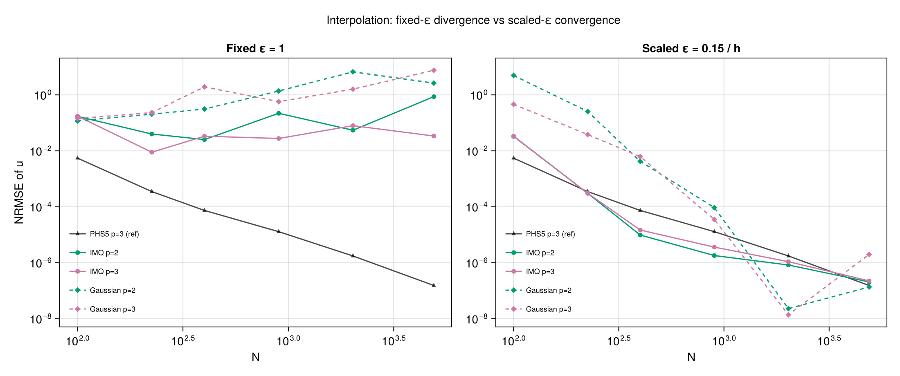
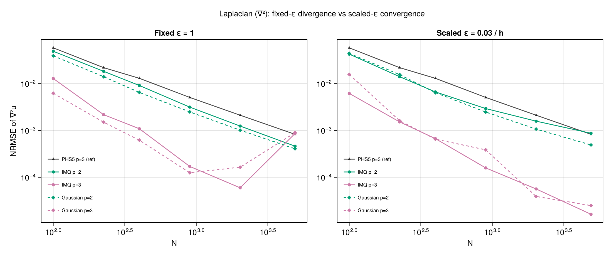
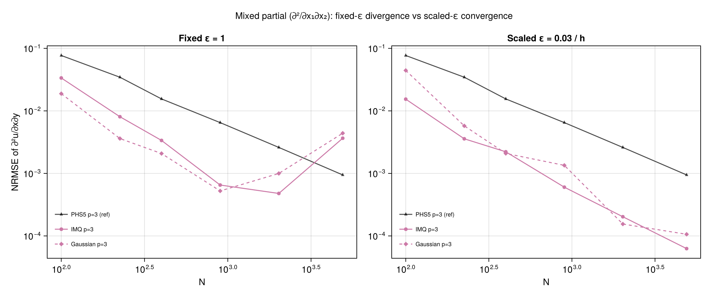

# Shape-Parameter Bases (IMQ, Gaussian)

Polyharmonic splines have no shape parameter and converge cleanly under
h-refinement. The shape-parameter bases — `IMQ` and `Gaussian` — do not: their
h-refinement behavior is dominated by the interaction between ε and the
stencil spacing, and fixing ε across a refinement sweep causes observable
error growth at large `N`. This page explains why and shows what cleans it up.

All `IMQ` / `Gaussian` h-refinement plots have been moved here so the operator
pages can stay focused on rate / poly_deg comparisons.

## The RBF uncertainty principle

For a stencil of physical radius `h`, the basis `ϕ(r) = exp(-(εr)²)` (Gaussian)
or `ϕ(r) = 1/√(1+(εr)²)` (IMQ) is characterized entirely by the non-dimensional
product `ε·h`. Two limits:

- `ε·h → ∞` (peaked basis, large ε relative to spacing): the RBF decays to zero
  between neighbors. The local system approaches a diagonal interpolant with
  poor approximation power.
- `ε·h → 0` (flat basis, small ε relative to spacing): every RBF evaluates to
  nearly the same value across the stencil. The RBF columns of the collocation
  matrix lose linear independence, the system is ill-conditioned, and the
  solved stencil weights grow large with alternating signs. Multiplying those
  weights through the evaluation amplifies floating-point roundoff error.

Truncation error (analytic approximation error) shrinks as `ε·h → 0`, but
rounding error grows. The two cross over at a problem-specific sweet spot —
the **trade-off principle** of Schaback [1], revisited by Driscoll & Fornberg
[2] and Fornberg & Flyer [3]. An ε-refinement sweep at fixed `N` shows this
directly as a U-shape in NRMSE vs ε (see `data/eps_refinement.csv`).

Now consider h-refinement with ε held constant. Stencil size `k` is fixed per
configuration, so as `N` grows the physical stencil radius shrinks as
`h ~ 1/√N`. The product `ε·h` collapses toward zero, driving the system into
the ill-conditioned regime. Error first decreases (truncation dominates), then
bottoms out and rises (rounding dominates). This is the "fixed ε" story below.

PHS is immune: it has no shape parameter and is scale-invariant when paired
with polynomial augmentation, so stencil shrinkage doesn't change conditioning.

## Fixed ε = 1 vs scaled ε = c/h

The fix is to scale ε so that `ε·h` stays near the sweet spot as `N` grows.
Stationary scaling `ε = c/h` keeps the non-dimensional basis shape constant
across the sweep. The constants `c` below are calibrated from the fixed-`N`
ε-refinement minima in `eps_refinement.csv` at `N=900`:

| Operator | `c` | Rationale |
|---|---|---|
| Interpolation | 0.15 | ε_opt ≈ 3–6 at `h = 1/30` → `ε·h ≈ 0.10–0.21` |
| Laplacian | 0.03 | ε_opt ≈ 0.5–1.0 → `ε·h ≈ 0.017–0.033` |
| Mixed partial | 0.03 | Same order (2nd derivative), same scaling |

Each plot below shows the same operator twice:

- **Left:** `IMQ` and `Gaussian` with `ε = 1` — the standard curves from the
  `h_refinement.csv` sweep, reproduced here.
- **Right:** `IMQ` and `Gaussian` with `ε = c/h` — a new sweep (`hseps`
  target in `generate_data.jl`) that holds `ε·h` constant.

A `PHS5/p=3` curve from the matched-degree sweep appears on both panels as a
non-shape-parameter reference. The y-axis is shared across panels.

### Interpolation

The fixed-ε panel shows non-monotone behavior and poly_deg-dependent stagnation.
Scaled ε recovers clean convergence; at large `N` the shape-parameter bases
beat the PHS5/p=3 reference by one to two orders of magnitude because a well-
tuned Gaussian or IMQ approaches spectral accuracy on smooth targets.

### Laplacian

At `ε = 1` the `p=2` curves flatten or turn up past `N ≈ 2000`; scaled ε
restores steady `~O(h²)–O(h³)` convergence, with `p=3` matching or beating
PHS5/p=3.

### Mixed partial

Only `p=3` is shown — `p=0` and `p=2` don't converge for mixed partials with
shape-parameter bases regardless of ε (a polynomial-augmentation issue, not a
conditioning one — see the [mixed partial
section](scalar-operators.md#mixed-partial-xxj)). With `p=3`, fixed ε shows
the classic turnaround around `N ≈ 2000`; scaled ε converges cleanly.

## Practical guidance

- **PHS is the default.** No parameter tuning, no conditioning cliff. Use
  `PHS(3; poly_deg=2)` or `PHS(5; poly_deg=3)` unless a specific reason
  motivates shape-parameter bases.
- **If you use `IMQ` or `Gaussian`:** scale ε with the local stencil spacing.
  For a quasi-uniform point cloud, `ε ≈ c / h` with `c` calibrated once via
  an ε-refinement sweep at representative `N` is straightforward. Do not
  carry a single ε across problems of different resolution without retuning.
- **Stable evaluation.** Algorithms like RBF-QR [4] and Contour–Padé [5]
  compute stable weights across the full ε range without the uncertainty
  principle, but are not currently implemented in this package.

## References

1. **Schaback, R.** (1995). *Error estimates and condition numbers for radial
   basis function interpolation.* Advances in Computational Mathematics,
   **3**, 251–264. DOI:
   [10.1007/BF02432002](https://doi.org/10.1007/BF02432002).
   *Original formulation of the trade-off / uncertainty principle.*
2. **Driscoll, T. A. and Fornberg, B.** (2002). *Interpolation in the limit of
   increasingly flat radial basis functions.* Computers & Mathematics with
   Applications, **43**(3–5), 413–422. DOI:
   [10.1016/S0898-1221(01)00295-4](https://doi.org/10.1016/S0898-1221(01)00295-4).
3. **Fornberg, B. and Flyer, N.** (2015). *A Primer on Radial Basis Functions
   with Applications to the Geosciences.* CBMS-NSF Regional Conference Series
   in Applied Mathematics, SIAM. Chapter 4 covers the conditioning–accuracy
   trade-off in detail.
4. **Fornberg, B. and Wright, G.** (2004). *Stable computation of multiquadric
   interpolants for all values of the shape parameter.* Computers &
   Mathematics with Applications, **48**(5–6), 853–867. DOI:
   [10.1016/j.camwa.2003.08.010](https://doi.org/10.1016/j.camwa.2003.08.010).
5. **Fornberg, B., Larsson, E., and Wright, G.** (2004). *A new class of
   oscillatory radial basis functions.* Computers & Mathematics with
   Applications, **51**(8), 1209–1222. DOI:
   [10.1016/j.camwa.2006.04.004](https://doi.org/10.1016/j.camwa.2006.04.004).
