# Vector & Higher-Rank Operators

Convergence for operators that produce tensor output or act on vector fields:
`hessian`, `jacobian`, `divergence`, `curl`. The test vector field is
`u(x) = [sin(πx₁) + 0.5cos(2πx₂), exp(x₁x₂)]` on `[0,1]²` with all components having
nonzero partials.

## Hessian

The Hessian assembles second partials `∂²u/∂xᵢ∂xⱼ` into an `N × D × D` tensor. Error is
reported as a Frobenius NRMSE. Because one of the four entries is a mixed partial, the
Hessian inherits the mixed-partial caveat — the non-converging combos are the same as
for the [mixed partial](scalar-operators.md#mixed-partial-xxj) operator.

!!! warning "Excluded combinations"
    Same set as mixed partial: `PHS1/p=1`, `PHS3/p=1`, `PHS3/p=2`, `PHS5/p=2`,
    `IMQ/p=0`, `IMQ/p=2`, `Gaussian/p=0`, `Gaussian/p=2` are omitted. **Use PHS5/p=3
    or higher for the full Hessian.**

### Which PHS order?

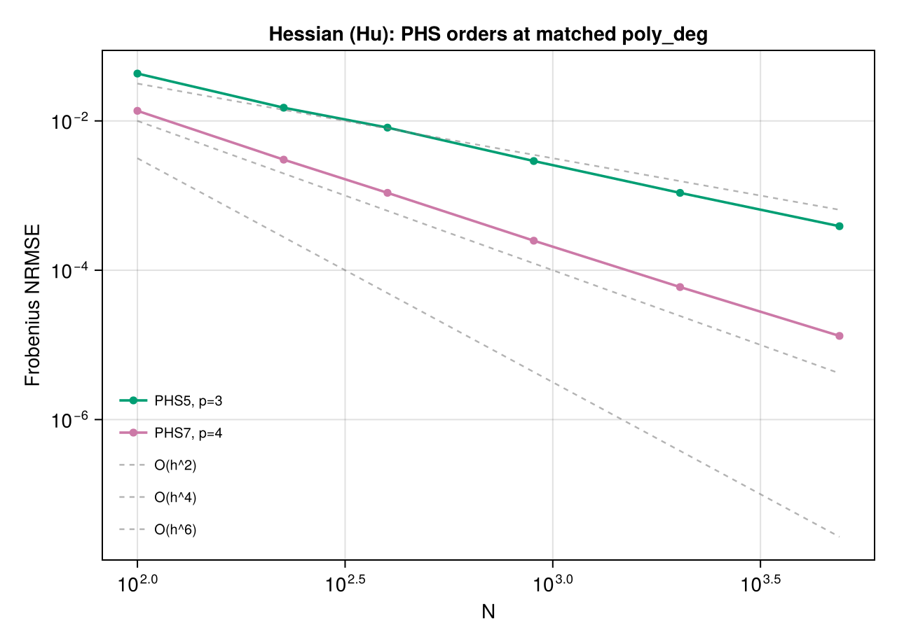

Only PHS5/p=3 and PHS7/p=4 converge. They reach `O(h²)` and `O(h⁴)` respectively.

### How much polynomial degree?

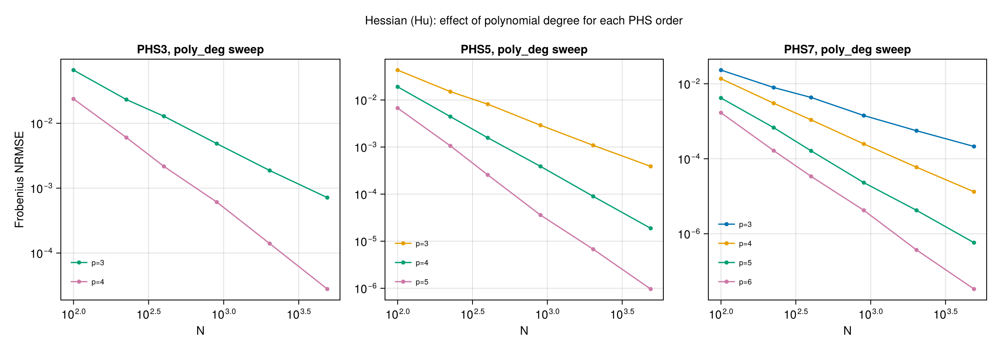

### Do IMQ / Gaussian help?

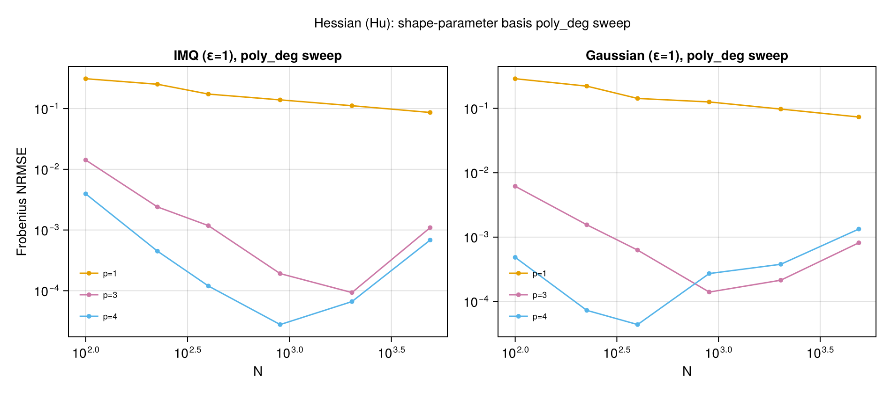

## Jacobian

The Jacobian of a vector field is an `N × Dᵢₙ × Dₒᵤₜ` tensor of first partials — no
second derivatives, no mixed-partial issue. Convergence matches the gradient cleanly.

### Which PHS order?

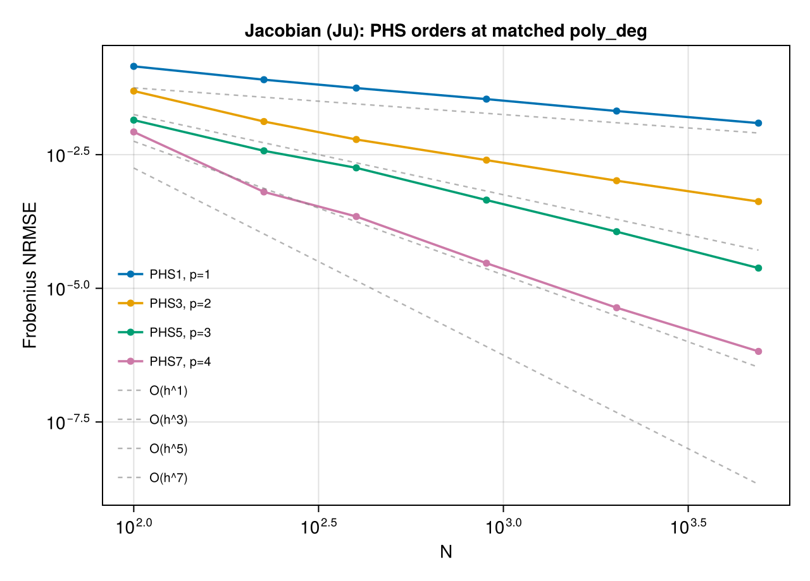

### How much polynomial degree?

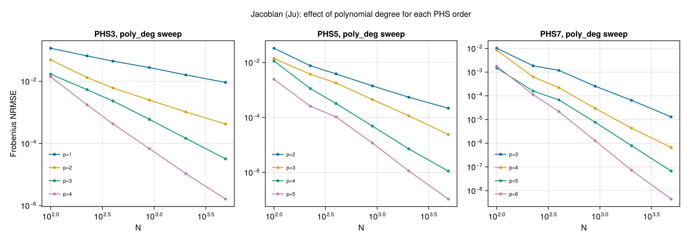

### Do IMQ / Gaussian help?

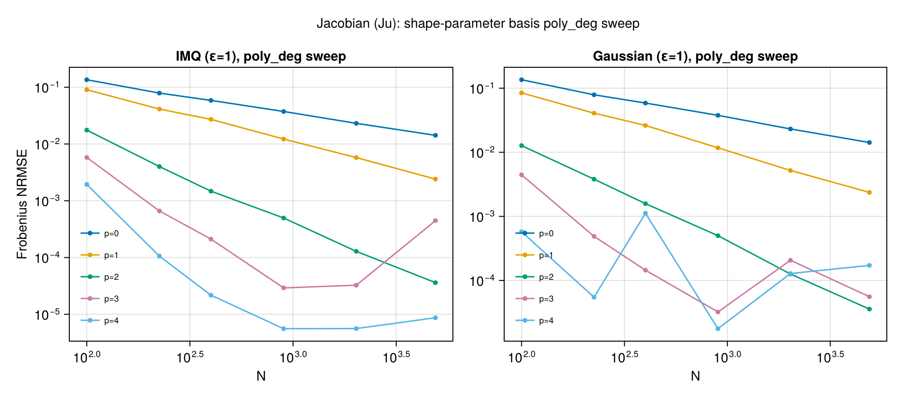

## Divergence (∇·)

`∇·u = ∂u₁/∂x₁ + ∂u₂/∂x₂` — a sum of first partials. Convergence rates match the
gradient; all PHS orders at matched poly_deg are well-behaved.

### Which PHS order?

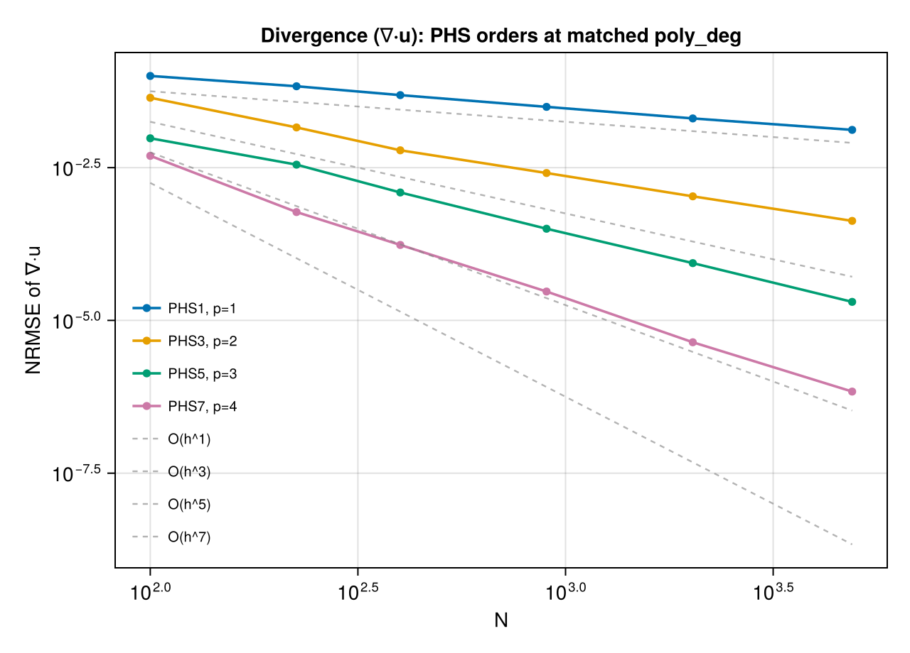

### How much polynomial degree?

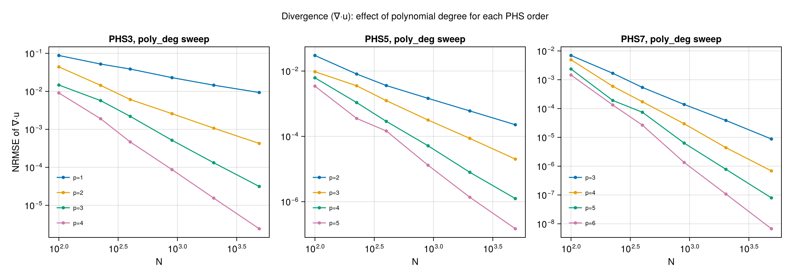

### Do IMQ / Gaussian help?

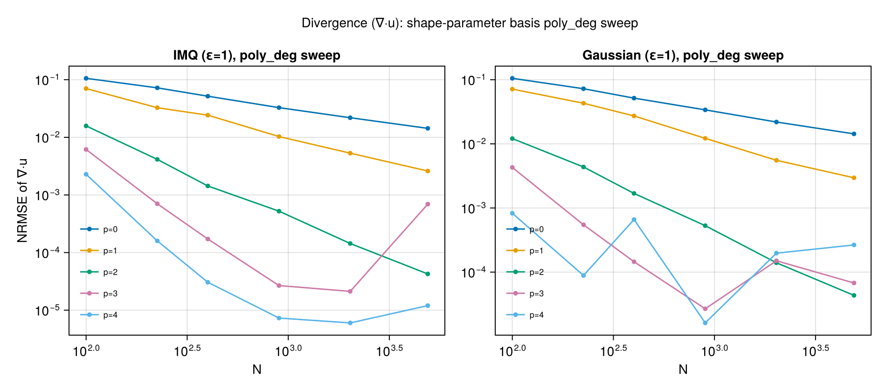

## Curl (∇×, 2D)

In 2D, `∇×u = ∂u₂/∂x₁ − ∂u₁/∂x₂` (the scalar z-component). Like divergence, this is a
first-derivative operator and follows the same convergence profile.

### Which PHS order?

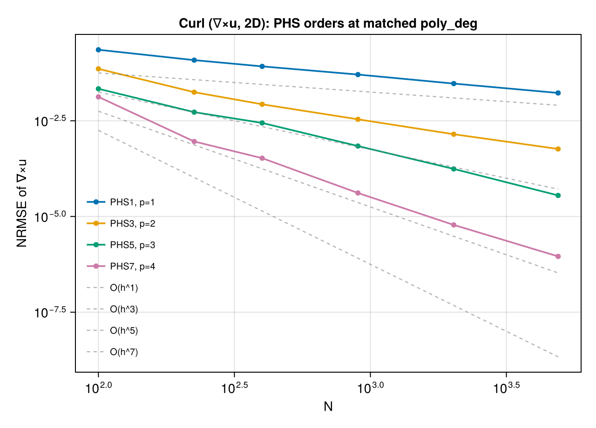

### How much polynomial degree?

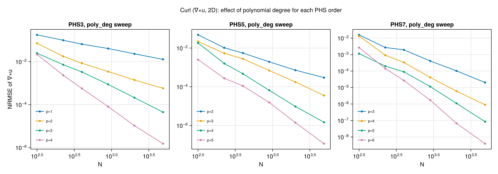

### Do IMQ / Gaussian help?

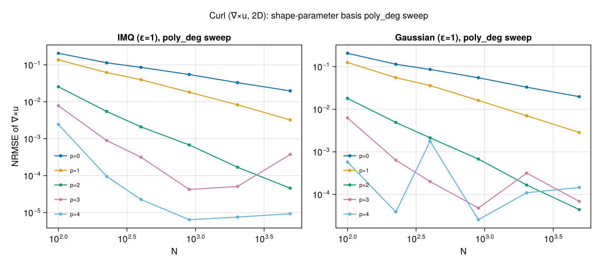
