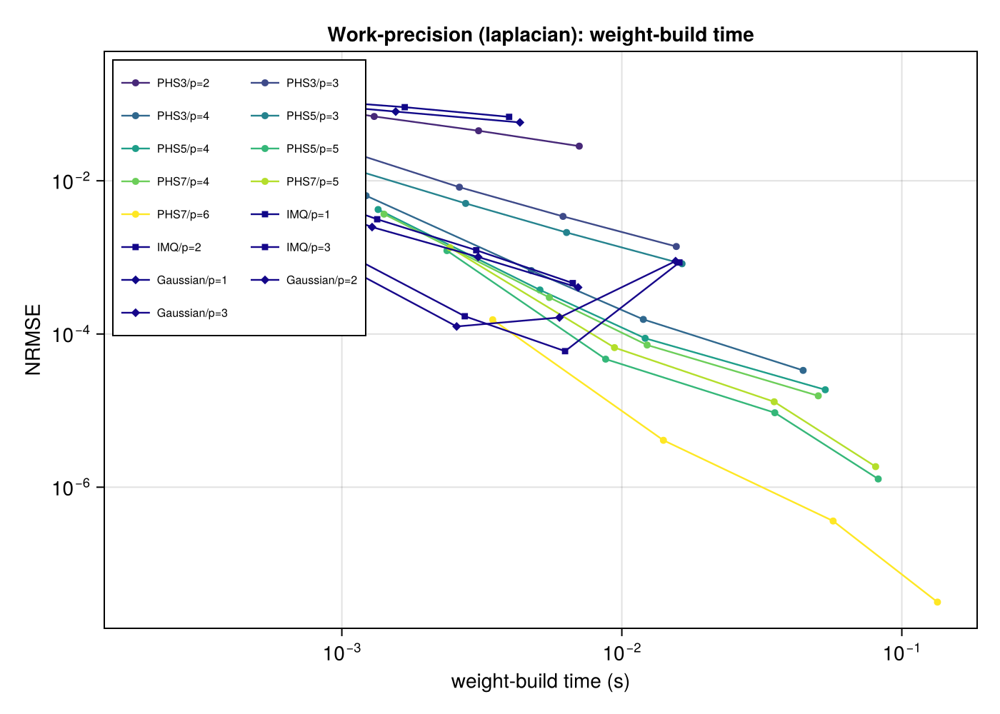
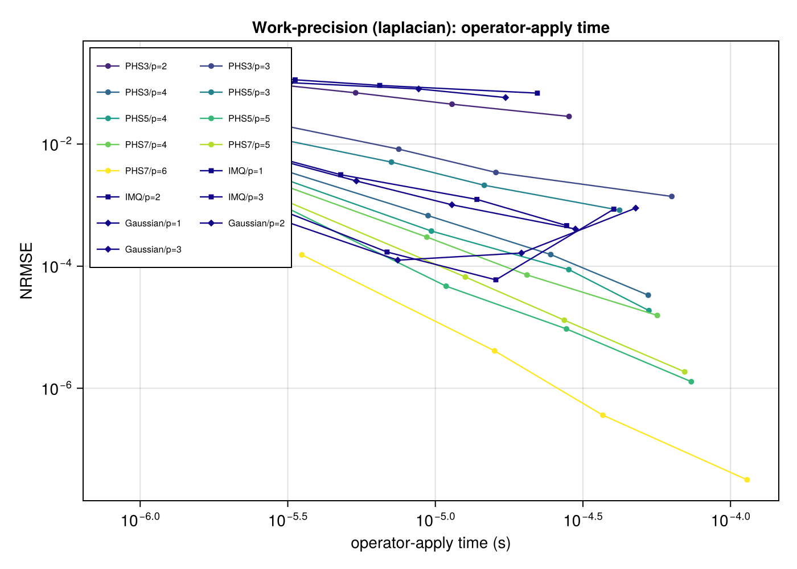
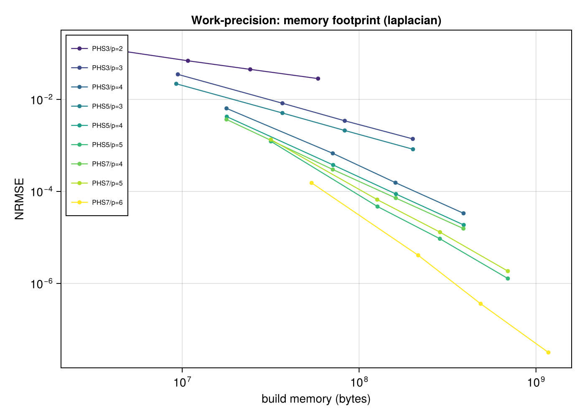
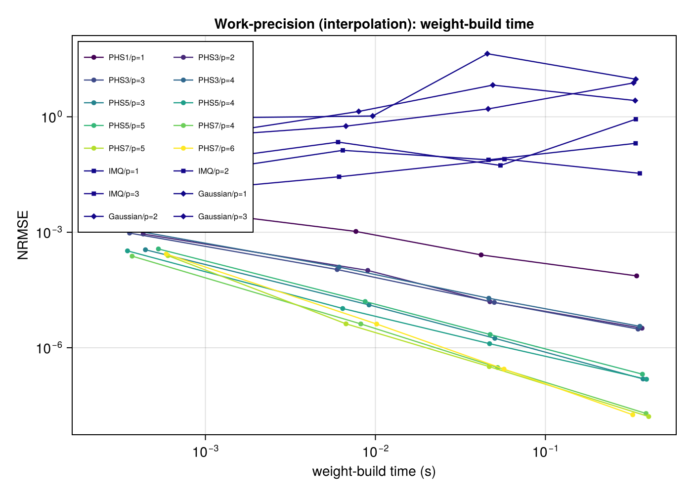
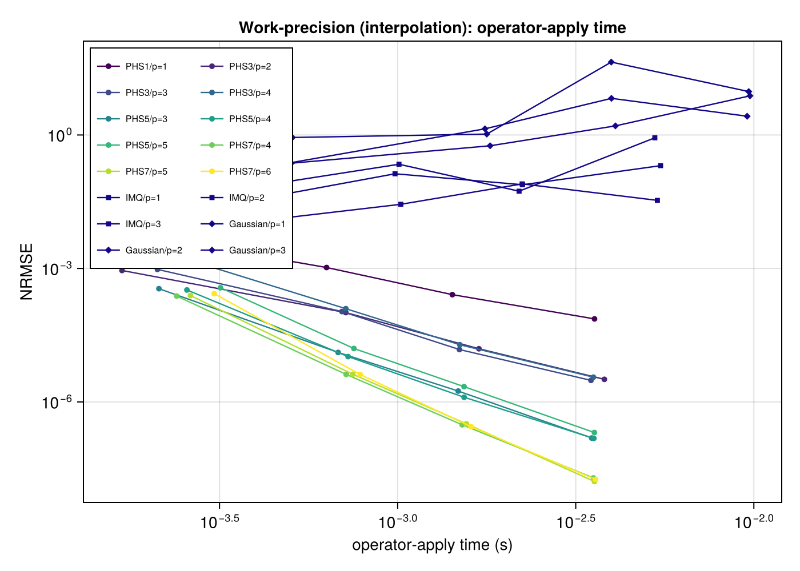

# Work-Precision

Convergence plots tell you *which* basis and polynomial degree are most accurate per
point. Work-precision plots tell you *what they cost*. This page uses `laplacian` as a
surrogate operator — the weight-assembly cost is nearly identical across local-stencil
differential operators since they share the same local-system structure — and treats
`Interpolator` separately because it uses a global stencil.

Each marker represents one `(basis, poly_deg)` configuration; connected markers are the
same configuration at different `N ∈ {225, 900, 2025, 4900}`. The lower-left corner is
"best": low error per unit time.

!!! info "Benchmark environment"
    Timings below were measured on: AMD Ryzen 9 9900X, 20 threads, Julia 1.12.6,
    RadialBasisFunctions 0.5.0. Absolute numbers will differ on other machines; the
    *relative* ordering of basis configurations is the informative part.

## Weight build time — Laplacian

Higher-order PHS with matched polynomial degree dominates the Pareto frontier. PHS7/p=6
reaches the lowest errors but spends the most time; PHS5/p=3 hits the sweet spot for most
applications. IMQ and Gaussian configurations cluster in the middle of the plot — they
deliver comparable accuracy at comparable cost, not a free lunch. `PHS1/p=1` is omitted
from this plot because its error is not useful for second-derivative operators (see the
[Laplacian section](scalar-operators.md#laplacian)).

## Apply time — Laplacian

Apply time is 10–100× shorter than build time; once weights are built, applying the
operator is a sparse matrix-vector product. This makes the "amortize over many applies"
decision easy: if you apply the same operator many times (e.g., time-stepping a PDE),
pick the highest-accuracy configuration you can afford during the one-time build.

## Memory footprint — Laplacian

Memory scales with `N × k × (k + npoly)` — the local-system factorization cost. Higher
`poly_deg` inflates both the stencil requirement and the factorization size.

## Interpolation

The `Interpolator` uses a global stencil: every evaluation touches every data point. Cost
scales very differently from local-stencil operators — the build cost is dominated by a
single `N×N` dense factorization, and the per-evaluation cost is `O(N)`.

### Build time

### Apply time

For scattered-data interpolation over more than a few thousand points, this global
approach becomes costly. Use `regrid` (local-stencil interpolation between point sets)
when you need to transfer data at scale.

## Practical guidance

- **Default**: `PHS(3; poly_deg=2)` — 2nd-order accurate, no tuning, well within 1 decade
  of the Pareto frontier on every plot above.
- **When you need more accuracy**: `PHS(5; poly_deg=3)` typically halves the error at
  ~3× the build cost. Beyond that, PHS7/p=4 offers diminishing returns unless you're
  targeting `< 10⁻⁶` error.
- **When build cost dominates**: compute once, apply many times. The apply-time plot is
  roughly 10–100× faster than build.
- **When you need mixed partials or the full Hessian**: start at PHS5/p=3 regardless of
  cost — the matched PHS3/p=2 does not converge (see the [scalar operators](scalar-operators.md#mixed-partial-xxj) section).
