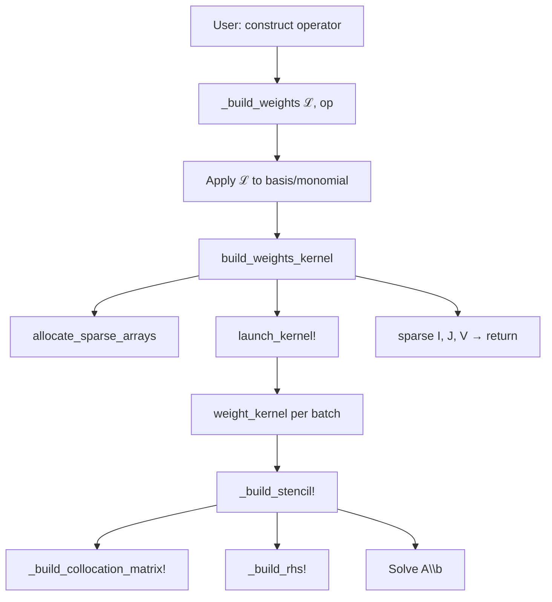

# Internals: RBF Weight Building System

This document explains the architecture of the solve system, which builds sparse weight matrices for RBF operators. It is intended for developers who want to understand or extend the package.

## Call Graph



## Architecture Overview

The solve system is organized into **four layers**, each with a clear responsibility:

```text
src/solve/
├── types.jl      # Layer 0: Shared data structures
├── assembly.jl   # Layer 1: Pure mathematical operations
├── execution.jl  # Layer 2: Parallel execution & allocation
└── api.jl        # Layer 3: Entry points & routing
```

| Layer | File | Purpose |
|-------|------|---------|
| 3 | `api.jl` | Entry points from operators |
| 2 | `execution.jl` | Memory allocation, parallel kernel execution, sparse matrix construction |
| 1 | `assembly.jl` | Pure mathematics: collocation matrix, RHS, stencil assembly |
| 0 | `types.jl` | Shared types and operator traits |

---

## System Flow

The system builds sparse weight matrices by computing stencil weights in parallel for each evaluation point:


**Key steps:**
1. **Route** — Operator calls `_build_weights`, which extracts data and applies the operator to the basis
2. **Allocate** — Pre-allocate sparse arrays with exact non-zero counts (k entries per evaluation point)
3. **Build A** — Construct the collocation matrix for each stencil's k-nearest neighbors
4. **Build b** — Construct the RHS by applying the differential operator to the basis at the evaluation point
5. **Solve** — Compute weights via `A \ b`
6. **Assemble** — Pack weights into global sparse matrix

---

## Layer Details

### Layer 0: `types.jl` — Data Structures

Defines shared types used throughout the solve system.

**Key types:**
- `SingleOperator`, `MultiOperator{N}` — Operator arity traits for pre-allocating RHS buffers

**When to modify:** Adding new operator traits or shared data structures.

---

### Layer 1: `assembly.jl` — Pure Mathematics

Contains all mathematical operations for building stencils. **No I/O, no parallelism** — fully testable in isolation.

**Key functions:**
- `_build_stencil!(A, b, ℒrbf, ℒmon, data, eval_point, basis, mon, k)` — Assembles and solves local system
- `_build_collocation_matrix!(A, data, basis, mon, k)` — Fills the collocation matrix
- `_build_rhs!(b, ℒrbf, ℒmon, data, eval_point, basis, k)` — Builds RHS vector

**When to modify:** Changing stencil mathematics or adding new RBF formulations.

---

### Layer 2: `execution.jl` — Parallel Execution

Handles memory management and parallel kernel execution via KernelAbstractions.jl.

**Key functions:**
- `build_weights_kernel(...)` — Main orchestrator: allocates, launches kernel, returns sparse matrix
- `allocate_sparse_arrays(TD, k, N_eval, num_ops, adjl)` — Exact non-zero allocation
- `launch_kernel!(...)` — Dispatches parallel kernel over batches
- `@kernel weight_kernel(...)` — Per-batch kernel that builds weights for each evaluation point

**When to modify:** Improving parallelism, changing batch strategy, or optimizing memory allocation.

---

### Layer 3: `api.jl` — Entry Points

Public-facing entry points that operators call to build weights.

**Key functions:**
- `_build_weights(ℒ, op)` — Entry from operator, extracts configuration
- `_build_weights(ℒ, data, eval_points, adjl, basis)` — Applies operator to basis
- `_build_weights(...; batch_size, device)` — Routes to kernel execution

**When to modify:** Adding new operator entry points or changing routing logic.

---

## Key Concepts

### Stencils

A **stencil** approximates a differential operator at a point using its k nearest neighbors:

$$\mathcal{L}u(\mathbf{x}_0) \approx \sum_{i=1}^{k} w_i \cdot u(\mathbf{x}_i)$$

The weights $w_i$ are computed by solving the local collocation system $\mathbf{A}\mathbf{w} = \mathbf{b}$.

### Collocation Matrix Structure

The collocation matrix has a block structure:

$$\begin{bmatrix} \mathbf{\Phi} & \mathbf{P} \\ \mathbf{P}^\top & \mathbf{0} \end{bmatrix}$$

where $\mathbf{\Phi}$ is the RBF kernel matrix and $\mathbf{P}$ is the polynomial augmentation matrix. The system is solved to find weights that exactly reproduce polynomials up to the specified degree.

---

## Performance Notes

**Memory allocation:**
- Exact non-zero counting before allocation (k entries per evaluation point)
- COO format construction with pre-computed row offsets

**Parallelization:**
- Batch processing to control memory usage
- Work arrays reused within each batch
- KernelAbstractions.jl enables CPU/GPU execution

---

## Advanced: Hermite Interpolation

For problems with boundary conditions, the package supports Hermite interpolation. This is triggered by providing boundary information (`is_boundary`, `boundary_conditions`, `normals`) to the operator constructor.

Hermite interpolation modifies the collocation matrix to incorporate boundary operators (Dirichlet, Neumann, Robin) at boundary nodes. This is an advanced feature primarily used for solving PDEs with explicit boundary conditions.

---

## Navigation Guide

| Want to... | Look in... |
|------------|------------|
| Modify stencil mathematics | `assembly.jl` |
| Improve parallelism or batching | `execution.jl` |
| Add a new operator entry point | `api.jl` |
| Understand sparse allocation | `execution.jl` → `allocate_sparse_arrays` |
| Debug a specific stencil | `assembly.jl` → `_build_stencil!` |
